# RC Engine - Architecture Reference Document (ARD)

> **Last updated:** 2026-03-02 | **Version:** v2 branch | **Tools:** 32 | **Tests:** 485

---

## Table of Contents

1. [System Overview](#system-overview)
2. [High-Level Architecture](#high-level-architecture)
3. [Module Inventory](#module-inventory)
4. [Domain Architecture](#domain-architecture)
5. [Core Infrastructure](#core-infrastructure)
6. [Shared Layer](#shared-layer)
7. [Web UI and Commercial Layer](#web-ui-and-commercial-layer)
8. [Cross-Domain Data Flow](#cross-domain-data-flow)
9. [State Management](#state-management)
10. [Quality Gate System](#quality-gate-system)
11. [Multi-LLM Strategy](#multi-llm-strategy)
12. [Security Architecture](#security-architecture)
13. [Knowledge System](#knowledge-system)
14. [Claude Code Configuration](#claude-code-configuration)
15. [Deployment](#deployment)
16. [Known Gaps and Disconnects](#known-gaps-and-disconnects)
17. [Test Coverage Map](#test-coverage-map)
18. [File Output Map](#file-output-map)

---

## System Overview

RC Engine is a **Model Context Protocol (MCP) server** that implements a structured product development pipeline. It exposes 35 tools across 4 domains, backed by a core infrastructure layer and a shared services layer.

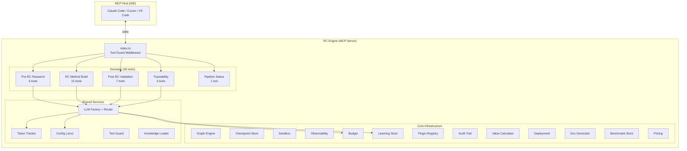

---

## High-Level Architecture

### Pipeline Flow

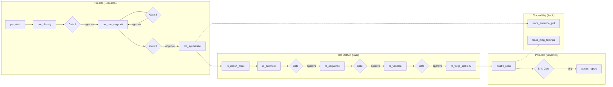

### Entry Point Wiring (`src/index.ts`)

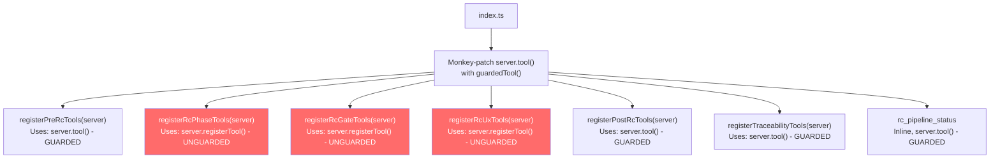

> **RESOLVED.** Both `server.tool()` and `server.registerTool()` are now wrapped with `guardedTool`. All 35 tools receive path validation and input size checks.

---

## Module Inventory

### Connection Status Legend

- CONNECTED: Imported and actively used by domain code
- DORMANT: Built, tested, but not imported by any domain
- INDIRECT: Used only by shared/llm layer, not by domains directly

### `src/core/` Modules

| Module               | Directory             | Status    | Used By                | Purpose                                                                          |
| -------------------- | --------------------- | --------- | ---------------------- | -------------------------------------------------------------------------------- |
| **Graph Engine**     | `core/graph/`         | DORMANT   | Tests only             | LangGraph-inspired execution engine (nodes, edges, gates, fan-out/fan-in, retry) |
| **Checkpoint Store** | `core/checkpoint/`    | DORMANT   | Tests only             | SQLite + WAL mode state persistence with Zod validation and time-travel          |
| **Sandbox**          | `core/sandbox/`       | CONNECTED | `shared/tool-guard.ts` | Path validation + input size limits                                              |
| **Budget**           | `core/budget/`        | INDIRECT  | `shared/llm/router.ts` | Cost tracking per model + circuit breaker                                        |
| **Observability**    | `core/observability/` | DORMANT   | Tests only             | EventBus + Tracer for pipeline events (has `graphId` fields ready)               |
| **Learning Store**   | `core/learning/`      | INDIRECT  | `shared/llm/router.ts` | Cross-project model performance tracking                                         |
| **Plugin Registry**  | `core/plugins/`       | DORMANT   | Tests only             | Plugin registration with capability declarations                                 |
| **Audit Trail**      | `core/collaboration/` | DORMANT   | Tests only             | Append-only SQLite audit log with 18 action types                                |
| **Value Calculator** | `core/value/`         | DORMANT   | Tests only             | Maps personas to roles/hourly rates for ROI calculation                          |
| **Benchmark Store**  | `core/benchmark/`     | DORMANT   | Tests only             | Performance metric recording and querying                                        |
| **Pricing**          | `core/pricing/`       | DORMANT   | Tests only             | 4-tier pricing, feature flags, usage metering                                    |
| **Deployment**       | `core/deployment/`    | DORMANT   | Tests only             | Readiness checks, profile detection, config generation                           |
| **Docs**             | `core/docs/`          | DORMANT   | Tests only             | Changelog parsing, project doc generation                                        |
| **LLM (core)**       | `core/llm/`           | INDIRECT  | `shared/llm/router.ts` | ModelRouter (task-type routing with budget awareness)                            |

### `src/shared/` Modules

| Module               | File                                                     | Status    | Used By                                                |
| -------------------- | -------------------------------------------------------- | --------- | ------------------------------------------------------ |
| **Config**           | `shared/config.ts`                                       | CONNECTED | All domains, all LLM clients                           |
| **Types**            | `shared/types.ts`                                        | CONNECTED | All domains                                            |
| **LLM Factory**      | `shared/llm/factory.ts`                                  | CONNECTED | Pre-RC, RC, Post-RC, Traceability                      |
| **LLM Clients**      | `shared/llm/{claude,openai,gemini,perplexity}-client.ts` | CONNECTED | Via factory                                            |
| **LLM Router**       | `shared/llm/router.ts`                                   | DORMANT   | Not used by any domain (domains call factory directly) |
| **Token Tracker**    | `shared/token-tracker.ts`                                | CONNECTED | Pre-RC, RC, Post-RC, Traceability                      |
| **Tool Guard**       | `shared/tool-guard.ts`                                   | CONNECTED | `index.ts` (but only for `server.tool()`)              |
| **Knowledge Loader** | `shared/knowledge-loader.ts`                             | CONNECTED | Pre-RC, RC                                             |

### `src/domains/` Modules

| Domain           | Tools | Registration                        | State Format                               | LLM Usage                                                   |
| ---------------- | ----- | ----------------------------------- | ------------------------------------------ | ----------------------------------------------------------- |
| **Pre-RC**       | 6     | `server.tool()` (guarded)           | Markdown + JSON comment (`PRC_STATE_JSON`) | Gemini (classify), Per-persona (stages), Claude (synthesis) |
| **RC Method**    | 15    | `server.registerTool()` (UNGUARDED) | Markdown + JSON comment (`RC_STATE_JSON`)  | Claude (all phases)                                         |
| **Post-RC**      | 7     | `server.tool()` (guarded)           | Markdown + JSON comment (`STATE_JSON`)     | Claude (Layer 3 scan)                                       |
| **Traceability** | 3     | `server.tool()` (guarded)           | Pure JSON file                             | Claude (optional, for acceptance criteria)                  |
| **Pipeline**     | 1     | `server.tool()` (guarded)           | Reads all domain states                    | None                                                        |

---

## Domain Architecture

### Domain 1: Pre-RC (Research)

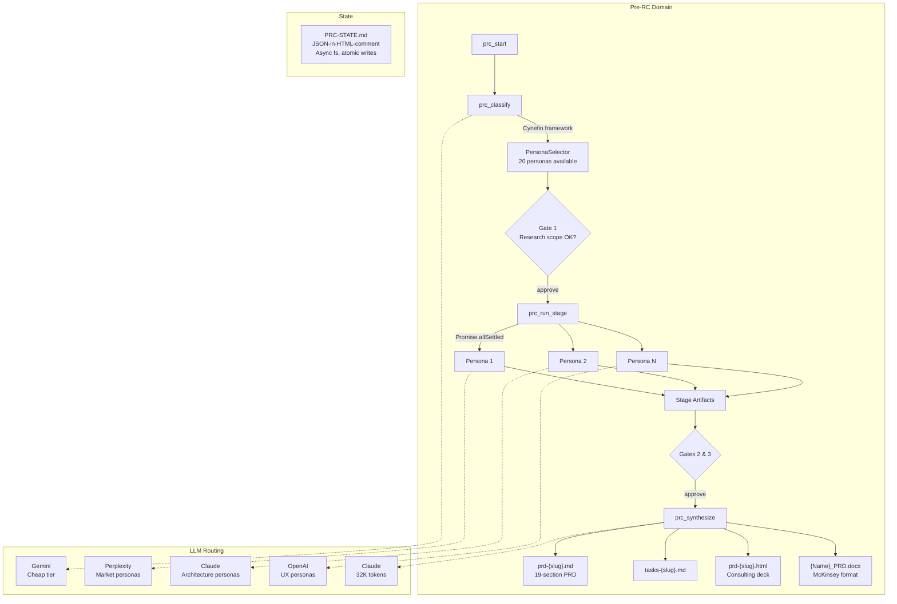

**Key files:**

- `tools.ts` - registers 6 tools via `server.tool()`
- `complexity-classifier.ts` - Cynefin framework (Clear/Complicated/Complex/Chaotic)
- `persona-selector.ts` - full registry of 20 personas with activation conditions
- `agents/persona-agent.ts` - single class reused for all 20 personas
- `state/state-persistence.ts` - Markdown + JSON serialization

**20 Personas** (in `knowledge/pre-rc/personas/`):
accessibility-advocate, ai-ml-specialist, business-model-strategist, cognitive-load-analyst, content-language-strategist, data-telemetry-strategist, demand-side-theorist, gtm-strategist, market-landscape-analyst, meta-product-architect, persona-coverage-auditor, prd-translation-specialist, primary-user-archetype, research-program-director, research-synthesis-specialist, secondary-edge-user, security-compliance-analyst, systems-architect, token-economics-optimizer, ux-systems-designer

---

### Domain 2: RC Method (Build)

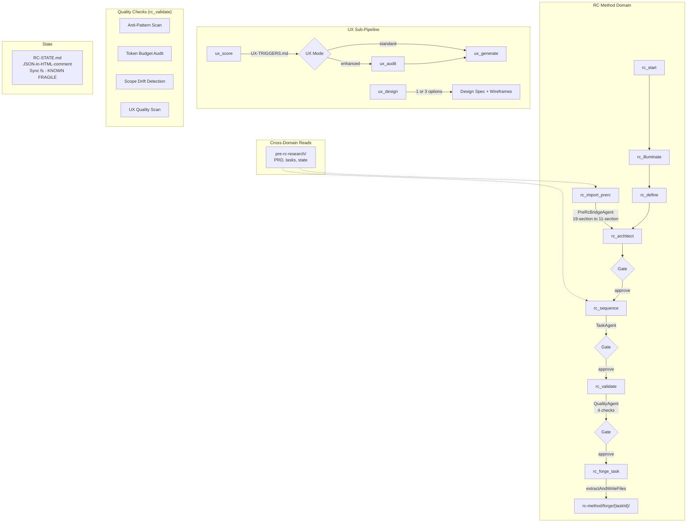

**Key files:**

- `orchestrator.ts` - central orchestrator, handles all phases, file extraction, state
- `tools/phase-tools.ts` - 8 tools via `server.registerTool()` (UNGUARDED)
- `tools/gate-tools.ts` - 3 tools via `server.registerTool()` (UNGUARDED)
- `tools/ux-tools.ts` - 4 tools via `server.registerTool()` (UNGUARDED)
- `agents/prerc-bridge-agent.ts` - 19-to-11 section PRD converter
- `agents/quality-agent.ts` - 4 quality checks
- `generators/diagram-generator.ts` - Mermaid dependency/Gantt/layer diagrams
- `generators/playbook-generator.ts` - reads ALL 4 domain dirs to produce master playbook

**8 Phases:** Illuminate, Define, Architect, Sequence, Validate, Forge, Connect, Compound

---

### Domain 3: Post-RC (Validation)

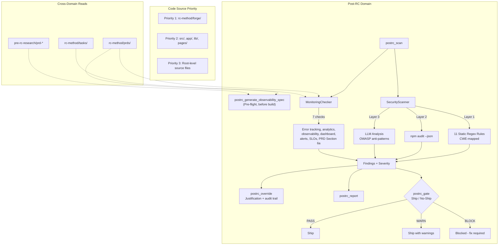

**Key files:**

- `modules/security/security-scanner.ts` - 3-layer scanner (static + npm audit + LLM)
- `modules/monitoring/monitoring-checker.ts` - 7 monitoring readiness checks
- `state/state-manager.ts` - Markdown + JSON state, atomic writes

**Static Security Rules (11):**
CWE-798 (hardcoded secrets), CWE-89 (SQL injection), CWE-95 (eval), CWE-79 (XSS/innerHTML), CWE-942 (CORS \*), CWE-78 (command injection), CWE-338 (Math.random), CWE-209 (error disclosure), CWE-347 (JWT without verify), CWE-22 (path traversal), plus `console.log` detection

**Knowledge base:** ANTI_PATTERNS_BREADTH.md (40KB) + ANTI_PATTERNS_DEPTH.md (257KB)

---

### Domain 4: Traceability

```mermaid
graph TD
    subgraph "Traceability Domain"
        ENHANCE[trace_enhance_prd] --> PARSER[PRD Parser<br/>3 extraction strategies]
        PARSER --> IDGEN[ID Generator<br/>Deterministic: PRD-{CAT}-{NNN}]
        IDGEN --> MATRIX[Traceability Matrix]

        MAP[trace_map_findings] --> TPARSER[RC Tasks Parser]
        MAP --> FPARSER[PostRC State Parser]
        TPARSER --> MAPPER[Finding Mapper<br/>Keyword overlap + module mapping]
        FPARSER --> MAPPER
        MAPPER --> COVERAGE[Coverage Matrix<br/>Implemented / Verified / Orphans]

        STATUS[trace_status] --> DISPLAY[ASCII Coverage Display]

        COVERAGE --> HTML_RPT[Consulting-grade HTML Report<br/>Playfair Display + Navy/Gold]
    end

    subgraph "Requirement Categories"
        CAT1[FUNC - Functional]
        CAT2[SEC - Security]
        CAT3[PERF - Performance]
        CAT4[UX - User Experience]
        CAT5[DATA - Data]
        CAT6[INT - Integration]
        CAT7[OBS - Observability]
        CAT8[BIZ - Business]
    end

    subgraph "Cross-Domain Reads"
        PRC2["pre-rc-research/prd-*"] -.-> ENHANCE
        RC_PRD2["rc-method/prds/PRD-*"] -.-> ENHANCE
        RC_TASKS2["rc-method/tasks/TASKS-*"] -.-> MAP
        POST_STATE["post-rc/state/POSTRC-STATE.md"] -.-> MAP
    end

    subgraph "State"
        TSTATE["TRACEABILITY.json<br/>Pure JSON file<br/>Different from all other domains"]
    end
```

---

## Core Infrastructure

### Graph Engine (DORMANT - not wired to any domain)

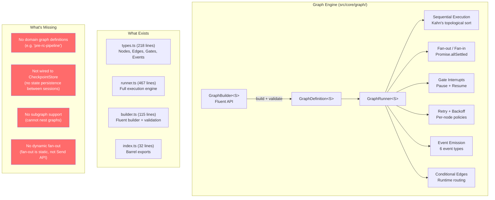

**Status:** Fully implemented, 31 tests passing, zero domain usage. The observability layer has `graphId` fields ready for integration.

**LangGraph mapping:**
| LangGraph | RC Engine Graph | Status |
|-----------|----------------|--------|
| Nodes | `GraphNode<S>` | Implemented |
| Edges | `GraphEdge<S>` with conditions | Implemented |
| State | Generic `<S>` threaded through | Implemented |
| Interrupts | `gate` node type + `GateResume` | Implemented |
| Fan-out | `fan-out` node + `Promise.allSettled` | Implemented |
| Fan-in | `fan-in` node + `MergeFn<S>` | Implemented |
| Checkpointing | Separate `CheckpointStore` exists | NOT wired |
| Streaming | `GraphEventListener<S>` | Implemented |
| Subgraphs | - | NOT implemented |
| Send API | - | NOT implemented |

---

### Other Core Modules (all DORMANT)

```mermaid
graph TD
    subgraph "DORMANT Core Modules"
        direction TB
        CKPT2["CheckpointStore<br/>SQLite + WAL + Zod validation<br/>Time-travel via versions"]
        AUDIT2["AuditTrail<br/>Append-only SQLite<br/>18 action types + threading"]
        PLUGIN2["PluginRegistry<br/>Capability-based registration"]
        VALUE2["ValueCalculator + RoleRegistry<br/>Persona-to-role mapping + ROI"]
        BENCH2["BenchmarkStore<br/>Performance metric recording"]
        PRICE2["Pricing<br/>4 tiers + feature flags + UsageMeter"]
        DEPLOY2["Deployment<br/>Readiness checks + config gen"]
        DOCS2["Doc Generator<br/>Changelog parsing + project docs"]
        OBS2["EventBus + Tracer<br/>Pipeline event streaming"]
    end

    subgraph "INDIRECT Core Modules (used by shared/llm only)"
        BUDGET2["CostTracker<br/>Per-model rate tables<br/>Budget warnings at 50%/80%"]
        CB2["CircuitBreaker<br/>3 failures to open<br/>30s cooloff to half-open"]
        LEARN2["LearningStore<br/>Global SQLite at ~/.rc-engine/learning.db<br/>Model ranking + project insights"]
        ROUTER2["ModelRouter<br/>cheap/standard/premium tiers<br/>Budget-aware downgrading"]
    end

    ROUTER2 --> BUDGET2
    ROUTER2 --> CB2
    ROUTER2 --> LEARN2

    style CKPT2 fill:#ffa500,color:#fff
    style AUDIT2 fill:#ffa500,color:#fff
    style PLUGIN2 fill:#ffa500,color:#fff
    style VALUE2 fill:#ffa500,color:#fff
    style BENCH2 fill:#ffa500,color:#fff
    style PRICE2 fill:#ffa500,color:#fff
    style DEPLOY2 fill:#ffa500,color:#fff
    style DOCS2 fill:#ffa500,color:#fff
    style OBS2 fill:#ffa500,color:#fff
```

> **Orange = DORMANT.** Built and tested but not imported by any domain code. The INDIRECT modules (Budget, CircuitBreaker, LearningStore, ModelRouter) are wired into the `shared/llm/router.ts` - but the router itself is also not used by domains (they call `llmFactory.getClient()` directly).

---

## Shared Layer

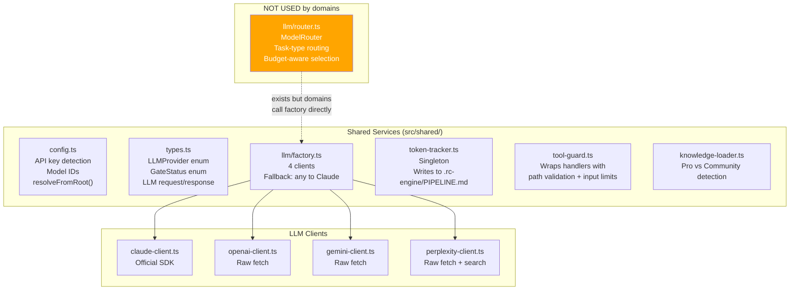

> **The ModelRouter is not used.** Domains call `llmFactory.getClient(provider)` with hardcoded provider choices. The router's sophisticated task-type routing, budget-aware downgrading, and learning-based selection are bypassed.

---

## Web UI and Commercial Layer

The web UI is a **full-stack Express + React application** that serves as the commercial product surface. It is separate from the MCP stdio server but calls the same 35 tools via an in-process bridge.

### Architecture

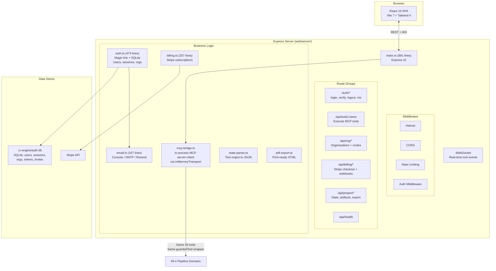

### MCP Bridge Pattern

The bridge (`web/server/mcp-bridge.ts`) is architecturally significant. It creates an **in-process MCP server and client** connected via `InMemoryTransport`:

```
Web Server  -->  MCP Client  <--InMemoryTransport-->  MCP Server  -->  Domain Tools
(Express)        (in-process)                          (in-process)     (same as CLI)
```

This means the web UI calls exactly the same tools with the same guards as the CLI. No code duplication. No API drift.

### Tier Enforcement

Tool access is gated by subscription tier:

| Tier       | Price  | Access                                    |
| ---------- | ------ | ----------------------------------------- |
| Free       | $0     | Pre-RC research only                      |
| Pro        | $79/mo | Full pipeline + security scan + UX design |
| Enterprise | Custom | All features + team seats + SLA           |

The server maps each tool to a required feature flag and checks the user's tier before execution.

### React Frontend Pages

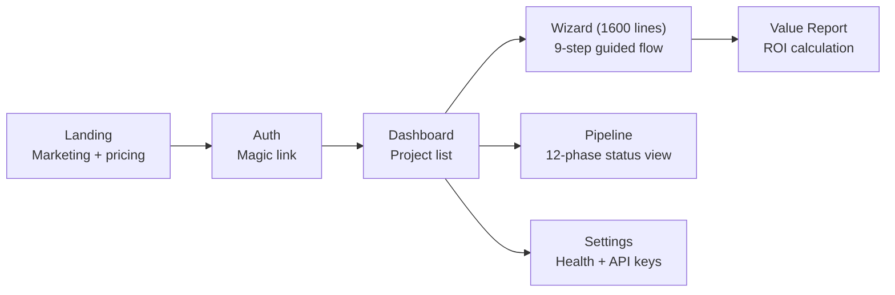

**9-step Wizard Flow:**

1. Idea input
2. Persona team view (select/deselect researchers)
3. Research execution with real-time status
4. Gate approvals
5. Design option cards (A/B/C)
6. Architecture review
7. Security scan results
8. Value report (human-equivalent cost savings)
9. Completion + download artifacts

**13 React Components:** Layout, ErrorBoundary, GateApproval, PhaseCard, ToolOutput, TokenDisplay, ConfirmDialog, TeamMemberCard, DesignOptionCard, DesignPreview, DiagramTabs, ValueChart, ValueDisplay

### Auth System

- **Magic link login** - email a one-time token (15-min expiry), verify via GET
- **Sessions** - 30-day HttpOnly secure cookies, SQLite-backed
- **Organizations** - create org, invite members, seat limits per tier
- **Dev bypass** - `RC_AUTH_BYPASS=true` returns a dev user with `pro` tier
- **Tables:** `users`, `sessions`, `organizations`, `magic_tokens`, `org_invites`

### Stripe Billing

- Checkout session creation for Pro (monthly + annual)
- Webhook handlers: `checkout.session.completed`, `customer.subscription.deleted`, `invoice.payment_failed`
- Same-origin URL validation to prevent open redirects
- Optional - system works without Stripe configured

### Email Providers

| Provider | When        | Config                                             |
| -------- | ----------- | -------------------------------------------------- |
| Console  | Development | Default, logs to stdout                            |
| SMTP     | Self-hosted | `SMTP_HOST`, `SMTP_PORT`, `SMTP_USER`, `SMTP_PASS` |
| Resend   | Production  | `RESEND_API_KEY`                                   |

---

## Cross-Domain Data Flow

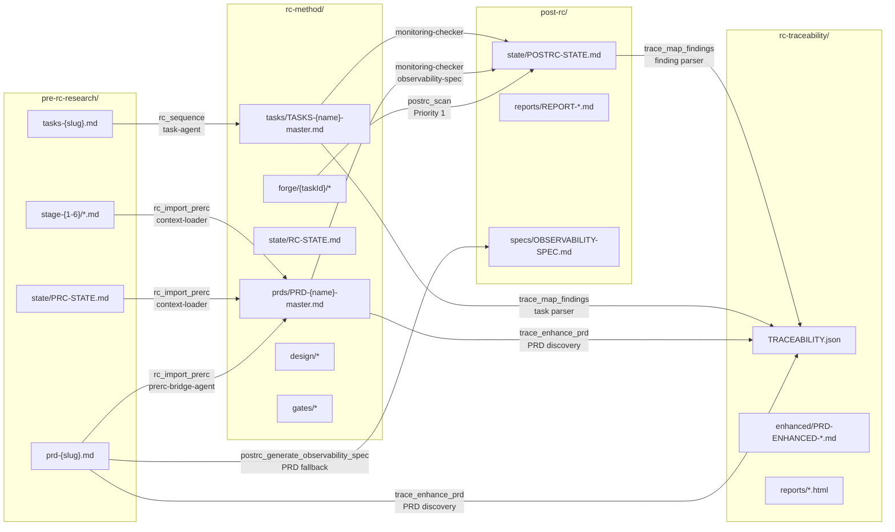

---

## State Management

### Four Different Approaches (inconsistency)

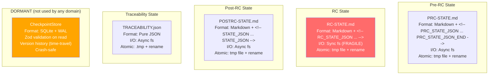

> **Red = fragile.** RC Method uses synchronous fs with regex parsing. Known corruption risk.
> **Orange = dormant.** The CheckpointStore provides all the properties the domains need (crash safety, validation, versioning) but none of them use it.

---

## Quality Gate System

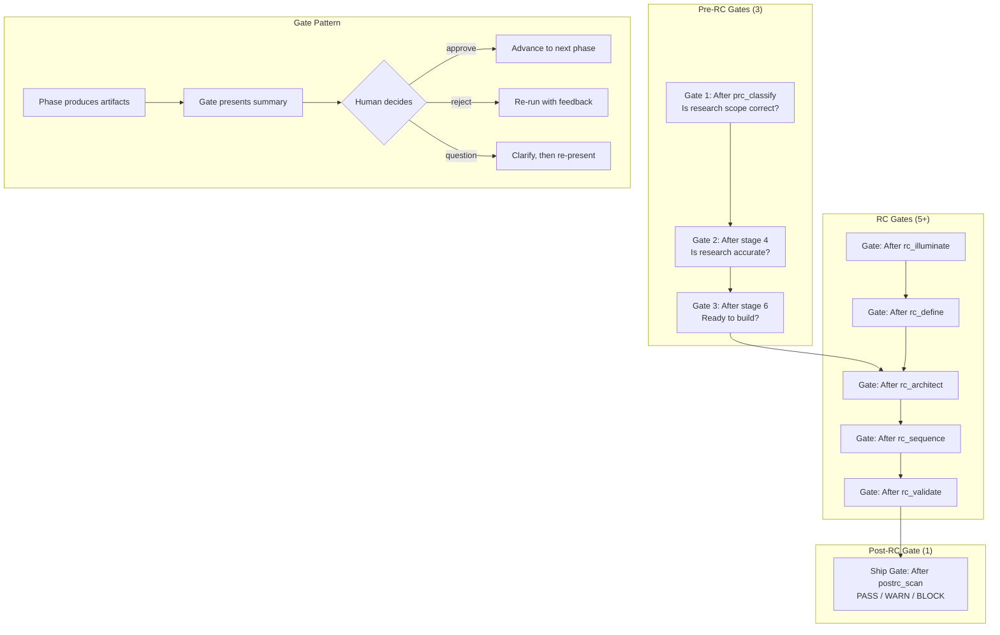

**Total: 9-11 gates** across the full pipeline (varies by path: import vs fresh start).
All gates require explicit human approval. Never auto-approved (except Gates 1-2 on Pre-RC import).

---

## Multi-LLM Strategy

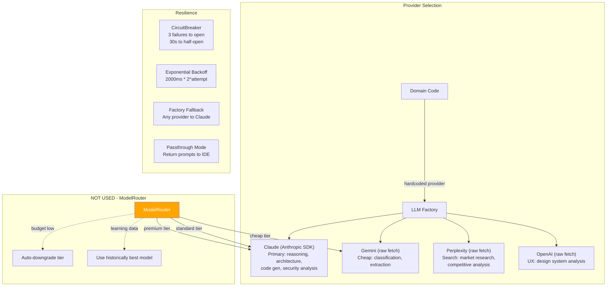

| Task Type                 | Provider            | Model Tier           | Used By                         |
| ------------------------- | ------------------- | -------------------- | ------------------------------- |
| Complexity classification | Gemini              | Cheap (~$0.0001)     | `prc_classify`                  |
| Market research           | Perplexity          | Standard             | Market-focused personas         |
| Architecture reasoning    | Claude              | Premium (~$0.015)    | `rc_architect`, `rc_forge_task` |
| PRD synthesis             | Claude              | Premium (32K tokens) | `prc_synthesize`                |
| Security analysis         | Claude              | Standard             | `postrc_scan` Layer 3           |
| UX audit                  | Claude/OpenAI       | Standard             | `ux_audit`, `ux_score`          |
| General research          | Per-persona routing | Varied               | `prc_run_stage`                 |

---

## Security Architecture

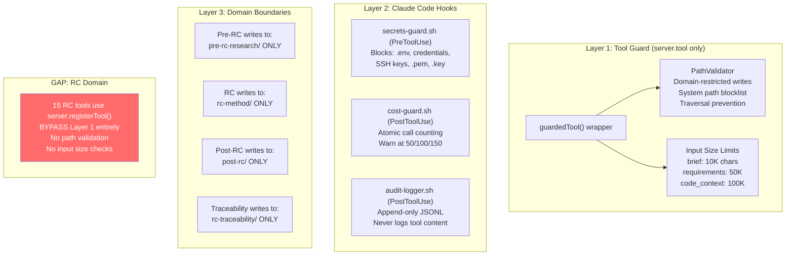

---

## Knowledge System

46 markdown files in `knowledge/` provide domain expertise to every pipeline tool.

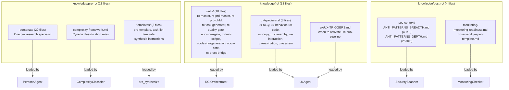

**Knowledge Loader** (`src/shared/knowledge-loader.ts`) detects Pro vs Community mode based on which files are present. Missing files degrade gracefully - the tool proceeds without that knowledge.

---

## Claude Code Configuration

The `.claude/` directory contains operational configuration that defines how AI assistants interact with the project.

### Directory Structure

```
.claude/
  settings.json          # Security deny/allow lists
  settings.local.json    # User-specific (gitignored)
  agent-memory/MEMORY.md # Persistent session memory

  rules/                 # Pipeline behavior rules
    onboarding.md        # First-time user flow
    conversation-ux.md   # Message templates + vocabulary mapping

  agents/                # Pipeline agent definitions (4)
    pre-rc-researcher.md
    rc-builder.md
    post-rc-validator.md
    traceability-auditor.md

  agents/agents/         # Compound Engineering agents (31)
    design/   (1)        # design-iterator
    docs/     (1)        # ankane-readme-writer
    research/ (5)        # repo-research-analyst, learnings-researcher, etc.
    review/  (14)        # security-sentinel, performance-oracle, etc.
    workflow/ (5)        # pr-comment-resolver, lint, etc.

  commands/              # Slash commands (22)
    workflows/           # Core workflow loop (5)
      plan.md, work.md, review.md, compound.md, brainstorm.md
    lfg.md, slfg.md, triage.md, changelog.md, deepen-plan.md, ...

  skills/                # Reusable skill definitions (20 directories)
    orchestrating-swarms/ (57KB), git-worktree/, brainstorming/,
    agent-native-architecture/, create-agent-skills/, ...

  hooks/                 # Runtime bash hooks (3)
    secrets-guard.sh     # PreToolUse: blocks access to secret files
    cost-guard.sh        # PostToolUse: warns at 50/100/150 calls
    audit-logger.sh      # PostToolUse: append-only JSONL audit log
```

### Hook Scripts

| Hook               | Event       | Action                                                                                              | Blocking?         |
| ------------------ | ----------- | --------------------------------------------------------------------------------------------------- | ----------------- |
| `secrets-guard.sh` | PreToolUse  | Blocks Read/Edit/Write/Bash on `.env`, `.ssh/`, `credentials`, `*.pem`, `*.key`, `*secret*`         | Yes (exit 2)      |
| `cost-guard.sh`    | PostToolUse | Counts tool calls per session using `flock` for atomicity. Warns at 50/100/150.                     | No (warning only) |
| `audit-logger.sh`  | PostToolUse | Appends `{tool, session_id, timestamp}` to `.rc-engine/audit/YYYY-MM-DD.jsonl`. Never logs content. | No                |

### Security Settings (`settings.json`)

**Deny list:** `.env*`, `.ssh/`, `.aws/`, `.config/gcloud/`, `.docker/config.json`, `.kube/config`, `.npmrc`, `*.pem`, `*.key`, `credentials.json`, `secrets/`, `rm -rf *`, `sudo *`, `chmod 777 *`

**Allow list:** `src/**`, `knowledge/**`, `docs/**`, `CLAUDE.md`, `package.json`, `npm test`, `npm run build`, `git status/diff/log`

---

## Deployment

### Docker

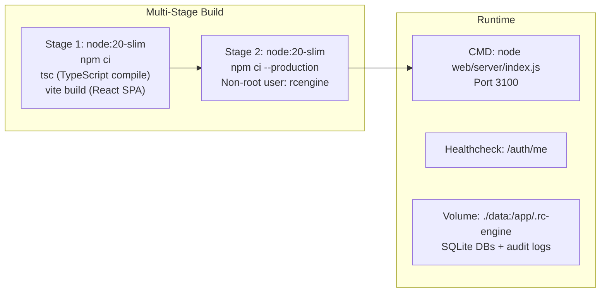

**Note:** The Docker image runs the **web server**, not the MCP stdio server. The MCP tools are accessed via the in-process bridge.

### Environment Variables

| Category   | Variables                                                 | Required?                               |
| ---------- | --------------------------------------------------------- | --------------------------------------- |
| AI Keys    | `ANTHROPIC_API_KEY`                                       | Yes (or passthrough mode)               |
| AI Keys    | `PERPLEXITY_API_KEY`                                      | Recommended                             |
| AI Keys    | `GOOGLE_GEMINI_API_KEY`, `OPENAI_API_KEY`                 | Optional                                |
| Web Server | `RC_WEB_PORT`, `ALLOWED_ORIGINS`                          | Optional (defaults: 3100, localhost)    |
| Auth       | `RC_AUTH_BYPASS`                                          | Dev only                                |
| Email      | `RESEND_API_KEY` or `SMTP_HOST/PORT/USER/PASS`            | Optional                                |
| Stripe     | `STRIPE_SECRET_KEY`, `STRIPE_WEBHOOK_SECRET`, 4 price IDs | Optional                                |
| Projects   | `RC_PROJECTS_DIR`                                         | Optional (default: `/tmp/rc-projects/`) |

### CI/CD

Single GitHub Actions workflow (`.github/workflows/ci.yml`):

- Triggers: push/PR to `v2` and `main`
- Matrix: Node 18, 20, 22
- Steps: `npm ci`, `tsc --noEmit`, `npm run lint`, `npm run format:check`, `npm test`
- Lint and format coverage: `src/`, `tests/`, `web/server/` (React frontend `web/src/` excluded)
- Does NOT: type-check web server, build web UI, run integration tests, deploy

---

## Known Gaps and Disconnects

### Critical

| #   | Gap                                 | Impact       | Details                                                                                                                                                                                                                                                                                                                                                                                                                                                                                                                                                                       |
| --- | ----------------------------------- | ------------ | ----------------------------------------------------------------------------------------------------------------------------------------------------------------------------------------------------------------------------------------------------------------------------------------------------------------------------------------------------------------------------------------------------------------------------------------------------------------------------------------------------------------------------------------------------------------------------- |
| 1   | ~~**RC tools bypass guardedTool**~~ | **RESOLVED** | The monkey-patch in `index.ts` now wraps both `server.tool()` and `server.registerTool()`. All 35 tools (Pre-RC, RC, Post-RC, Traceability, pipeline status) receive path validation and input size checks. 5 new `guardedTool` unit tests added to `sandbox.test.ts`.                                                                                                                                                                                                                                                                                                        |
| 2   | ~~**Graph Engine not wired**~~      | **RESOLVED** | `GraphCoordinator<S>` base class bridges `GraphRunner` + `CheckpointStore` with persistent gate interrupts. 3 domain graph definitions built: Pre-RC (11 nodes, 3 gates, fan-out research), RC Method (12 nodes, 6 gates, sequential phases), Post-RC (5 nodes, fan-out/fan-in parallel scans, ship gate). Domain coordinators (`PreRcCoordinator`, `RcCoordinator`, `PostRcCoordinator`) wire graph topologies to injectable handlers. 31 new tests (12 coordinator + 19 graph topology).                                                                                    |
| 3   | ~~**CheckpointStore not used**~~    | **RESOLVED** | All 4 domain state managers now use CheckpointStore (SQLite + WAL + Zod validation) as primary storage. Shared `store-factory.ts` provides singleton per-project instances at `{projectPath}/.rc-engine/state.db`. `pipeline-id.ts` derives deterministic 22-char pipeline IDs from project paths. 4 domain Zod schemas validate state on read. Legacy markdown/JSON files kept as write-only exports for human readability. Transparent migration on first load. Cross-domain reads (traceability -> post-rc) now typed CheckpointStore calls instead of regex file parsing. |

### High

| #   | Gap                                | Impact             | Details                                                                                                                                                                                                                                                                             |
| --- | ---------------------------------- | ------------------ | ----------------------------------------------------------------------------------------------------------------------------------------------------------------------------------------------------------------------------------------------------------------------------------- |
| 4   | **ModelRouter not used**           | No smart routing   | Sophisticated task-type routing with budget-aware downgrading and learning-based selection exists but domains call `llmFactory.getClient()` directly with hardcoded providers.                                                                                                      |
| 5   | **AuditTrail not used**            | No audit logging   | Enterprise-grade append-only SQLite audit trail with 18 action types, comment threading, and query API exists but no domain writes to it. Gate decisions are logged to markdown files instead.                                                                                      |
| 6   | **Observability not used**         | No pipeline events | EventBus + Tracer with `graphId`-aware pipeline events exist but are dormant. No real-time visibility into pipeline execution.                                                                                                                                                      |
| 7   | ~~**State format inconsistency**~~ | **RESOLVED**       | All 4 domains now use CheckpointStore as primary (SQLite), with consistent save/load patterns and Zod validation on read. Markdown/JSON files are write-only exports. Bugs fixed: Post-RC silent-default-on-error (now throws), Traceability race condition (randomized tmp names). |

### Medium

| #   | Gap                                       | Impact                       | Details                                                                                                                                                                                                                                                                                                                                           |
| --- | ----------------------------------------- | ---------------------------- | ------------------------------------------------------------------------------------------------------------------------------------------------------------------------------------------------------------------------------------------------------------------------------------------------------------------------------------------------- |
| 8   | **PluginRegistry not used**               | No extensibility             | Plugin system with capability declarations exists but no plugins are registered.                                                                                                                                                                                                                                                                  |
| 9   | **ValueCalculator not used**              | No ROI reporting             | Persona-to-role mapping with hourly rates exists but isn't called.                                                                                                                                                                                                                                                                                |
| 10  | **PricingTier not used**                  | No tier enforcement via core | 4-tier pricing with feature flags and usage metering exists in core but isn't wired to tool execution. Agent memory mentions tier enforcement but it's not in the domain code path.                                                                                                                                                               |
| 11  | **Deployment tools not used**             | No deploy pipeline           | Readiness checks, profile detection, and config generation exist but aren't connected.                                                                                                                                                                                                                                                            |
| 12  | **3 of 4 LLM clients use raw fetch**      | Missing SDK features         | OpenAI, Gemini, and Perplexity clients use raw `fetch` instead of official SDKs. Missing: automatic retries, streaming, type safety.                                                                                                                                                                                                              |
| 13  | **No end-to-end integration tests**       | Pipeline untested as whole   | 421 unit tests across 20 files but zero tests running the full Pre-RC to Post-RC pipeline.                                                                                                                                                                                                                                                        |
| 14  | **Forge writes to staging, not source**   | Dead-end output              | `rc_forge_task` writes to `rc-method/forge/{taskId}/` - not the project source tree. No automated integration step.                                                                                                                                                                                                                              |
| 15  | **Web UI deps in devDependencies**        | Broken prod install          | React, Vite, Tailwind are in `devDependencies` but the web UI is a production feature. `npm install --production` breaks the web UI.                                                                                                                                                                                                              |
| 16  | ~~**Web UI not linted**~~                 | **RESOLVED**                 | Web server (`web/server/`) is now linted (ESLint) and formatted (Prettier) alongside `src/` and `tests/`. React frontend (`web/src/`) still excluded (needs JSX/React ESLint config).                                                                                                                                                             |
| 17  | ~~**Web server not type-checked in CI**~~ | **RESOLVED**                 | TypeScript project references implemented: root `tsconfig.json` has `composite: true`, `web/tsconfig.json` has `references: [{ "path": ".." }]`. Cross-boundary imports fixed (`../../src/` changed to `../../dist/`). CI runs `tsc --noEmit -p web/tsconfig.json` as a separate step. `stripe` and `@types/nodemailer` added as devDependencies. |
| 18  | **Two separate MCP server instances**     | Potential drift              | `src/index.ts` (stdio) and `web/server/mcp-bridge.ts` (in-process) both register tools independently. A tool added to one but not the other would cause divergence.                                                                                                                                                                               |
| 19  | **Auth DB has no migrations**             | Schema fragility             | `web/server/auth.ts` creates tables via `CREATE TABLE IF NOT EXISTS`. No versioned migrations. Schema changes require manual intervention.                                                                                                                                                                                                        |
| 20  | **Only 11 static security rules**         | Coverage gaps                | Missing: SSRF, prototype pollution, open redirects, XXE, insecure deserialization, clickjacking, session fixation. LLM Layer 3 compensates but static rules should catch the obvious patterns.                                                                                                                                                    |

---

## Test Coverage Map

| Test File                                    | Module Tested                  | Tests | Status                                           |
| -------------------------------------------- | ------------------------------ | ----- | ------------------------------------------------ |
| `tests/core/graph-runner.test.ts`            | Graph Engine                   | 31    | All pass (CONNECTED)                             |
| `tests/core/graph-coordinator.test.ts`       | Graph Coordinator              | 12    | All pass (CONNECTED)                             |
| `tests/core/checkpoint-store.test.ts`        | Checkpoint Store               | 31    | All pass (CONNECTED)                             |
| `tests/core/store-factory.test.ts`           | Store Factory + Pipeline ID    | 13    | All pass (CONNECTED)                             |
| `tests/core/state-schemas.test.ts`           | Domain State Schemas           | 15    | All pass (CONNECTED)                             |
| `tests/core/sandbox.test.ts`                 | Path Validator + Input Limits  | 56    | All pass (CONNECTED)                             |
| `tests/core/budget.test.ts`                  | Cost Tracker + Circuit Breaker | ~15   | All pass (INDIRECT)                              |
| `tests/core/observability.test.ts`           | EventBus + Tracer              | ~10   | All pass (dormant)                               |
| `tests/core/pricing.test.ts`                 | Pricing Tiers + UsageMeter     | ~15   | All pass (dormant)                               |
| `tests/core/audit-trail.test.ts`             | Audit Trail                    | ~10   | All pass (dormant)                               |
| `tests/core/benchmark.test.ts`               | Benchmark Store                | ~10   | All pass (dormant)                               |
| `tests/core/docs.test.ts`                    | Changelog + Doc Gen            | ~10   | All pass (dormant)                               |
| `tests/core/deployment.test.ts`              | Deploy Readiness               | ~10   | All pass (dormant)                               |
| `tests/core/learning-store.test.ts`          | Learning Store                 | ~15   | All pass (INDIRECT)                              |
| `tests/core/model-router.test.ts`            | Model Router                   | ~10   | All pass (dormant - router not used by domains) |
| `tests/core/plugin-registry.test.ts`         | Plugin Registry                | ~10   | All pass (dormant)                               |
| `tests/core/value-calculator.test.ts`        | Value + Roles                  | ~10   | All pass (dormant)                               |
| `tests/agent-eval/tool-selection.test.ts`    | Tool Descriptions              | 33    | All pass (CONNECTED)                             |
| `tests/domains/design-types.test.ts`         | Design Schemas                 | ~5    | All pass                                         |
| `tests/domains/design-agent-parsing.test.ts` | Wireframe Parsing              | ~5    | All pass                                         |
| `tests/domains/pdf-export.test.ts`           | HTML Export                    | ~5    | All pass                                         |
| `tests/domains/diagram-generator.test.ts`    | Mermaid Diagrams               | ~5    | All pass                                         |
| `tests/domains/playbook-generator.test.ts`   | Playbook Gen                   | ~5    | All pass                                         |
| `tests/domains/graph-definitions.test.ts`    | Domain Graph Topologies        | 19    | All pass (CONNECTED)                             |

**485 total tests.** Core infrastructure (Graph Engine, CheckpointStore, State Schemas) now wired to domains. Zero integration tests for the actual pipeline.

---

## File Output Map

### What gets produced per domain

```
project-root/
  pre-rc-research/               # Pre-RC domain output
    brief.md                     # Original product brief
    classification.md            # Cynefin complexity result
    persona-selection.md         # Which personas were activated
    prd-{slug}.md                # 19-section PRD (master output)
    prd-{slug}.html              # Consulting deck (HTML)
    {Name}_PRD.docx              # McKinsey-format Word doc
    tasks-{slug}.md              # Task breakdown
    RESEARCH-INDEX.md            # Token usage by persona
    state/PRC-STATE.md           # Pipeline state
    gates/gate-{1,2,3}.md        # Gate decision records
    stage-{1-6}/{persona-id}.md  # Per-persona research artifacts

  rc-method/                     # RC Method domain output
    prds/PRD-{name}-master.md    # 11-section PRD (converted or generated)
    prds/PRD-{name}-ux.md        # UX child PRD (optional)
    tasks/TASKS-{name}-master.md # Formal task list with T-IDs
    gates/{phase}-{num}.md       # Gate decision records
    forge/{taskId}/*             # Generated code (staging dir)
    design/*                     # Design specs + wireframes
    diagrams/*                   # Mermaid + HTML diagrams
    state/RC-STATE.md            # Pipeline state
    PLAYBOOK-{name}.md           # Master architecture playbook

  post-rc/                       # Post-RC domain output
    state/POSTRC-STATE.md        # Scan results + findings
    reports/REPORT-{scanId}.md   # Validation report
    remediation/REMEDIATION-TASKS-{scanId}.md
    specs/OBSERVABILITY-SPEC.md  # Pre-flight monitoring spec
    overrides/*                  # Override records (immutable)

  rc-traceability/               # Traceability domain output
    TRACEABILITY.json            # Coverage matrix state
    enhanced/PRD-ENHANCED-*.md   # PRD with requirement IDs
    reports/*.md                 # Coverage reports
    reports/*.html               # Consulting-grade HTML reports

  .rc-engine/                    # Runtime metadata
    state.db                     # CheckpointStore (SQLite + WAL, all domain state)
    PIPELINE.md                  # Token usage summary
```
